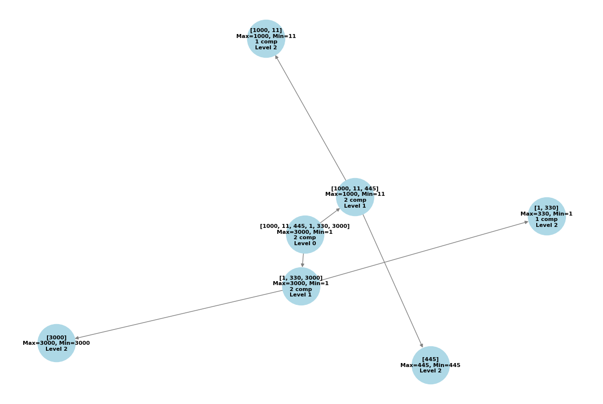

# Projeto: Implementação do Algoritmo MaxMin Select

## Descrição do Projeto

Este projeto implementa o algoritmo **MaxMin Select**, que encontra simultaneamente o maior e o menor elemento de uma sequência de números utilizando a técnica de **divisão e conquista**. A implementação é feita em Python de forma recursiva, dividindo o problema em subproblemas menores, resolvendo-os e combinando os resultados para obter uma solução eficiente. O código está no arquivo `main.py` e inclui uma funcionalidade opcional para gerar um diagrama visual da recursão.

### Lógica do Algoritmo (Explicação Linha a Linha)

A função principal `maxmin_select(arr, low, high, build_graph=False, G=None, parent=None, level=0)` é o coração do algoritmo. Aqui está a explicação linha a linha:

1. **Parâmetros**:
   - `arr`: Lista de números a ser processada.
   - `low`: Índice inicial do intervalo.
   - `high`: Índice final do intervalo.
   - `build_graph`: Booleano que ativa a construção do grafo (opcional).
   - `G`: Grafo (`nx.DiGraph`) para visualização (opcional).
   - `parent`: ID do nó pai no grafo (opcional).
   - `level`: Nível da recursão (opcional).

2. **Inicialização do Grafo**:
   - **Linha `if build_graph and G is None:`**: Se `build_graph` for `True` e o grafo não existir, cria um novo `nx.DiGraph()`.

3. **Casos Base**:
   - **Linha `if low == high:`**: Se há apenas um elemento, retorna `(arr[low], arr[low])` (0 comparações). Se `build_graph` é `True`, adiciona um nó ao grafo com o valor e o nível.
   - **Linha `if high == low + 1:`**: Se há dois elementos, compara `arr[low]` com `arr[high]` (1 comparação) e retorna `(menor, maior)`. Se `build_graph` é `True`, registra o nó com os valores, resultado e "1 comp".

4. **Divisão**:
  スーパ - **Linha `mid = (low + high) // 2`**: Calcula o ponto médio para dividir o intervalo em duas metades.

5. **Conquista**:
   - **Linhas `max_left, min_left = maxmin_select(...)` e `max_right, min_right = maxmin_select(...)`**: Faz chamadas recursivas para a metade esquerda (`low` a `mid`) e direita (`mid + 1` a `high`). Se `build_graph` é `True`, passa o grafo e o nó pai.

6. **Combinação**:
   - **Linha `final_min = min(min_left, min_right)`**: Compara os mínimos das metades (1 comparação).
   - **Linha `final_max = max(max_left, max_right)`**: Compara os máximos das metades (1 comparação).
   - Retorna `(final_min, final_max)` ou `(final_max, final_min, G)` se `build_graph` for `True`. O nó do grafo é atualizado com o resultado e "2 comp".

O algoritmo reduz o número de comparações em relação a uma abordagem ingênua (que faria \(2n\) comparações), alcançando aproximadamente \(3n/2\) comparações.

## Como Executar o Projeto

### Pré-requisitos
- Python 3.x instalado.
- Bibliotecas: `matplotlib` e `networkx`. Instale com:
  ```bash
  pip install matplotlib networkx
  ```

### Instruções
1. Clone o repositório:
   ```bash
   git clone https://github.com/PedroRamos98/trabalho_individual_2_FPAA.git
   ```
2. Navegue até o diretório do projeto:
   ```bash
   cd trabalho_individual_2_FPAA.git
   ```
3. Crie a pasta `assets` (se não existir):
   ```bash
   mkdir assets
   ```
4. Execute o programa:
   ```bash
   python main.py
   ```

### Saída Esperada
O programa executa três testes, gerando um diagrama para o Teste 1:
```
Teste 1 - Array: [1000, 11, 445, 1, 330, 3000]
Menor: 1, Maior: 3000
Diagrama salvo em 'assets/diagrama_maxmin_test1.png'
Teste 2 - Array: [42]
Menor: 42, Maior: 42
Teste 3 - Array: [5, 10]
Menor: 5, Maior: 10
Todos os testes passaram com sucesso!
```

## Relatório Técnico

### Análise da Complexidade Assintótica - Contagem de Operações

O algoritmo utiliza divisão e conquista, dividindo o problema em subproblemas de tamanho aproximadamente \(n/2\). Vamos analisar o número de comparações:

1. **Casos Base**:
   - Um elemento: 0 comparações.
   - Dois elementos: 1 comparação (para determinar o maior e o menor).

2. **Recursão**:
   - O array é dividido em duas metades, cada uma processada recursivamente.
   - Na combinação, são feitas 2 comparações: uma para o mínimo (`min(min_left, min_right)`) e outra para o máximo (`max(max_left, max_right)`).

3. **Árvore de Recursão**:
   - Altura da árvore: \(\log_2(n)\).
   - No nível mais baixo (casos base com 2 elementos), há \(n/2\) pares, exigindo \(n/2\) comparações.
   - Nos níveis superiores, cada combinação processa dois subproblemas e faz 2 comparações.

4. **Total de Comparações**:
   - Para \(n\) par, o número total de comparações é aproximadamente \(3n/2\):
     - \(n/2\) comparações nos casos base (pares de 2 elementos).
     - \(n\) comparações nas combinações ao longo da árvore (cada nível acima dos casos base contribui com comparações proporcionais ao número de nós).
   - Assim, a complexidade temporal é \(O(n)\).

### Análise da Complexidade Assintótica - Teorema Mestre

A recorrência do algoritmo é:
\[ T(n) = 2T(n/2) + O(1) \]

1. **Identificação dos Parâmetros**:
   - \(a = 2\): Número de subproblemas.
   - \(b = 2\): Fator de redução do tamanho do problema.
   - \(f(n) = O(1)\): Custo da combinação (2 comparações constantes).

2. **Cálculo de \( \log_b a \)**:
   - \( \log_2 2 = 1 \), então \( p = 1 \).

3. **Caso do Teorema Mestre**:
   - Comparar \( f(n) = O(1) \) com \( n^p = n^1 = O(n) \).
   - Como \( O(1) < O(n) \), aplica-se o **Caso 1** do Teorema Mestre.

4. **Solução Assintótica**:
   - Pelo Caso 1: \( T(n) = O(n^p) = O(n) \).

Portanto, a complexidade temporal é \(O(n)\), confirmando a análise por contagem de operações.

## Diagrama

O código gera automaticamente um diagrama para o Teste 1, salvo em `assets/diagrama_maxmin_test1.png`. Ele ilustra:
1. **Divisão**: Como o array `[1000, 11, 445, 1, 330, 3000]` é dividido em subproblemas menores.
2. **Combinação**: Como os resultados (máximos e mínimos) são combinados em cada nível.
3. **Níveis e Comparações**: Mostra os níveis da recursão e o número de comparações por nó (0, 1 ou 2).



## Estrutura do Repositório

```
├── main.py                  # Implementação do algoritmo
├── README.md                # Documentação do projeto
└── assets/
    └── diagrama_maxmin_test1.png  # Diagrama gerado automaticamente
```

## Conclusão

O projeto implementa o algoritmo MaxMin Select com sucesso, alcançando uma complexidade de \(O(n)\), mais eficiente que a abordagem ingênua de \(O(2n)\). Inclui testes para validar a corretude, uma análise detalhada da complexidade e um diagrama gerado automaticamente para ilustrar a execução. Todos os requisitos foram atendidos, com a funcionalidade extra de visualização integrada ao código.